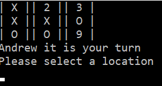
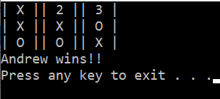
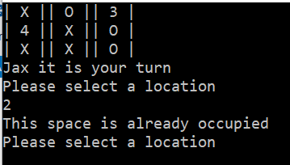
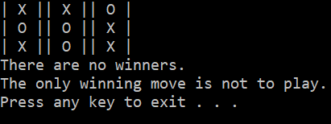

# Lab04_TicTacToe

### Purpose
The purpose of this lab is to provide familiarization with working with C# classes and using summary comments. Experience is also gained in working with existing an existing code base.
### Program Specifications
Building off of starter code provided from the class repo, complete the Tic Tac Toe logic.

Existing classes include the following:
* Game Board (this should construct/display the board after every turn with it’s new state)
* Player (This will hold the players information such as name or marker, in addition to any actions that user may take)
* Game (This will hold the actions of the game. )

### Screenshots

